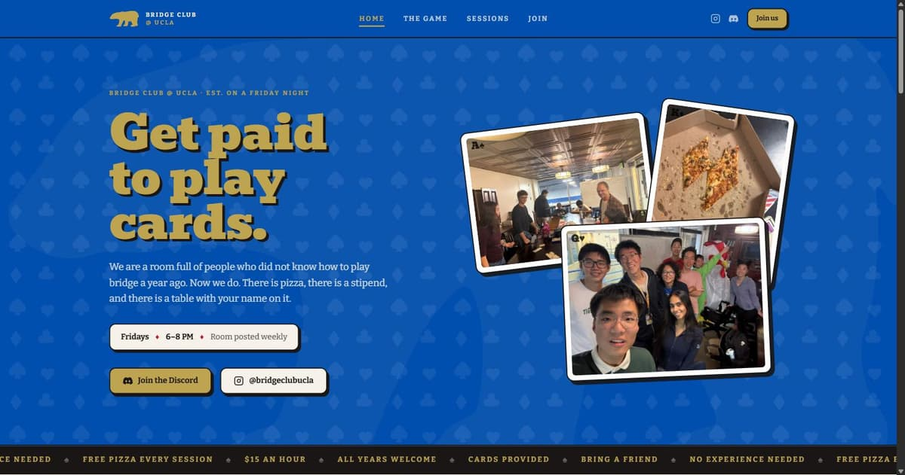
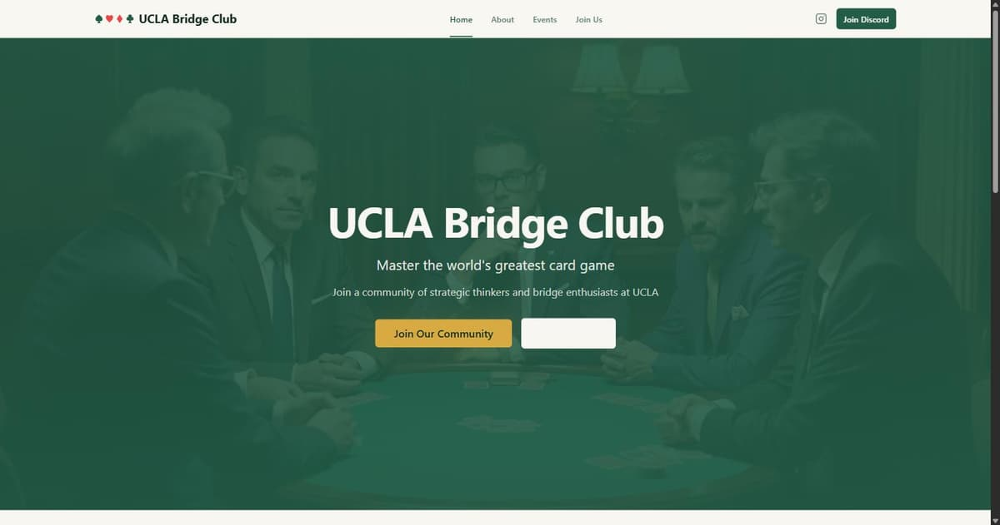
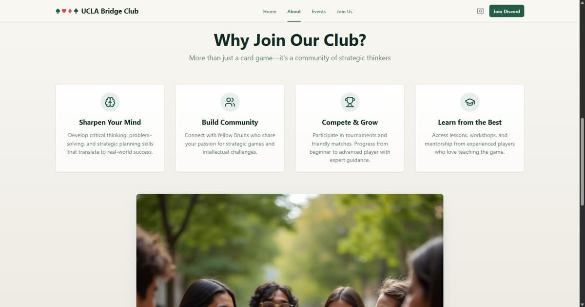
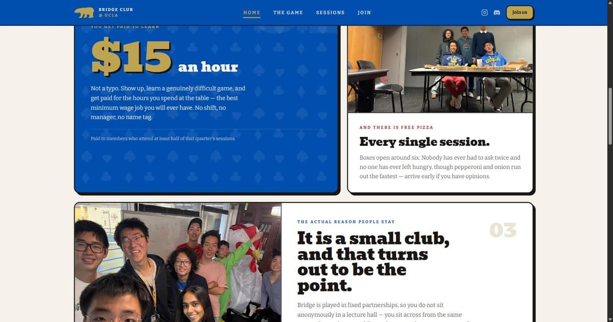
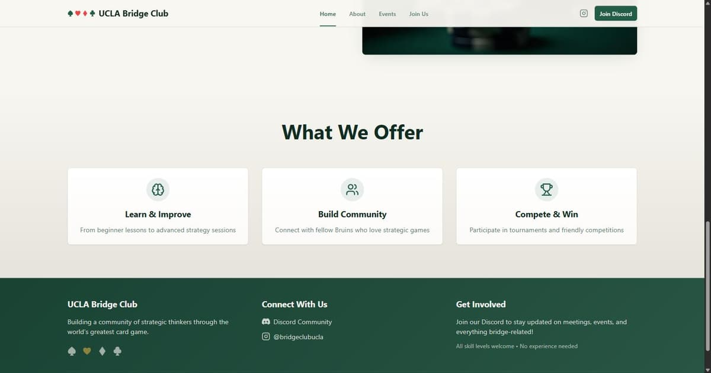
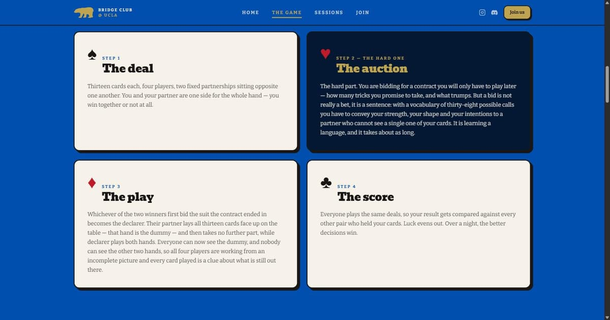
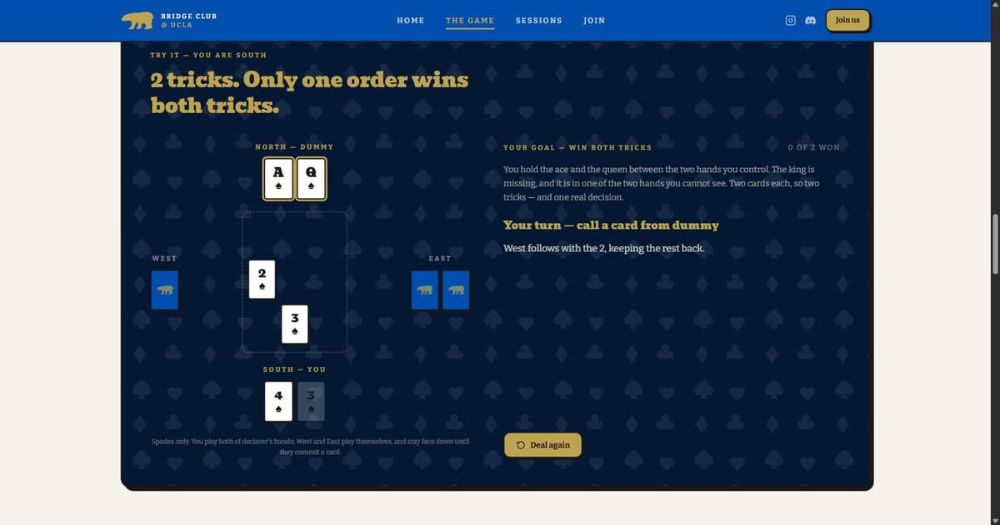

# Bridge Club @ UCLA

The club website. **Fridays, 6–8 PM** — free pizza, $15/hour to learn, no experience needed.



- **Discord** — https://discord.gg/BXm7HPEuHQ
- **Instagram** — [@bridgeclubucla](https://www.instagram.com/bridgeclubucla/)

---

## Running it

Needs Node 18+ and npm.

```sh
npm install
npm run dev      # http://localhost:8080
```

| Script | What it does |
| --- | --- |
| `npm run dev` | Dev server with hot reload on port 8080 |
| `npm run build` | Production build into `dist/` |
| `npm run preview` | Serve the built `dist/` locally |
| `npm run lint` | ESLint over the whole project |

Stack: **Vite + React 18 + TypeScript + Tailwind CSS**, with [shadcn/ui](https://ui.shadcn.com/) primitives and React Router.

---

## Editing the site

Almost everything an officer needs to change lives in **one file**: [`src/lib/club.ts`](src/lib/club.ts).

| To change… | Edit |
| --- | --- |
| Meeting day, time, or room | `CLUB.meets` in `src/lib/club.ts` |
| Discord invite or Instagram handle | `CLUB.discord` / `CLUB.instagram` |
| The stipend amount or its condition | `CLUB.pay` |
| The "learn bridge elsewhere" links | `RESOURCES` in the same file |
| Photos | Drop optimised JPEGs in `src/assets/photos/`, then update the imports at the top of the relevant page |
| Page copy | The page files in `src/pages/` |

Because the meeting details are read from `CLUB.meets` everywhere, changing the room in `club.ts` updates the hero, the Sessions page, the footer, and the meta description at once.

### Project layout

```
src/
  lib/club.ts            All club facts + the curated bridge resources
  components/
    BearMark.tsx         The club bear, traced from the printed flyer (one SVG path)
    Navbar.tsx           Sticky nav
    Footer.tsx
    Bits.tsx             Shared pieces: buttons, photo cards, playing cards, page headers
    FinesseDemo.tsx      The playable bridge puzzle on the Game page
    ui/                  shadcn/ui primitives (mostly unused)
  pages/
    Home.tsx             /
    AboutPage.tsx        /about  → "The Game"
    Events.tsx           /events → "Sessions"
    JoinUs.tsx           /join
    NotFound.tsx
  assets/photos/         Club photos, resized to 1400px and compressed
  index.css              Design tokens — colours, type, the reusable flyer devices
public/                  Favicons (the bear), robots.txt
source-images/           Original full-res photos and flyers (gitignored, not deployed)
```

### Design system

Every colour is sampled directly from the club's own printed flyers, so the site and the Instagram posts match. Tokens live at the top of [`src/index.css`](src/index.css).

| Token | Hex | Used for |
| --- | --- | --- |
| `--blue` | `#004aad` | The dominant field — nav, hero, headers |
| `--blue-deep` / `--blue-ink` | darker blues | Depth, the dark "table" panels |
| `--gold` | `#c2a54c` | Display type, buttons, the bear |
| `--red` | `#bf1b2c` | Hearts and diamonds, accents |
| `--cream` | warm off-white | Paper background |
| `--ink` | near-black | Text and the keyline borders |

Type is **Bevan** (the heavy slab from the flyers) for display and **Bitter** for body copy.

Three reusable classes carry the flyer's look:

- `.text-stamp` — the hard black offset shadow under gold headlines
- `.keyline` — the white callout box: fat black border, hard offset shadow
- `.photo-card` — photos hung like dealt cards, tilted, straightening on hover

---

## The redesign

The site was originally generated by [Lovable](https://lovable.dev/) and rebuilt from scratch in early 2026 (with [Claude Code](https://claude.com/claude-code)). The original build is still live at **https://ucla-bridge-hub.lovable.app/** until the next deploy, so the before/after below can be checked against the real thing.

### What was wrong

The first version looked like a generic AI template, and none of it was actually *us*:

- Four AI-generated stock images — men in suits around a green baize table, blurred students on a leafy quad. Nobody in any of them had ever been to a session.
- A muted green-and-gold palette invented from nothing, ignoring the blue-and-gold identity already used on every flyer and Instagram post.
- Vague copy — "Master the world's greatest card game", "Sharpen Your Mind" — that never mentioned the three things people actually turn up for.
- Rows of identical icon-in-a-circle cards.

### Before → after

**Home page**

| Before | After |
| --- | --- |
|  |  |
| AI stock photo, invented green palette, "Master the world's greatest card game" | Real photos from last year's sessions, the club's own blue and gold, and the actual pitch |

**Why join**

| Before | After |
| --- | --- |
|  |  |
| Four identical icon cards: "Sharpen Your Mind", "Build Community"… | The three real reasons — the $15/hour stipend, the free pizza, and the people — at different weights |

**The Game**

| Before | After |
| --- | --- |
|  |  |
| Three cards: "Learn & Improve", "Build Community", "Compete & Win" | The four phases of a hand, with the auction singled out as the hard one |

### What changed

**The brand came off the flyers, not out of thin air.** The blue (`#004aad`), gold (`#c2a54c`) and card-suit red were sampled pixel-by-pixel from the club's own Canva posters. The bear logo was traced from flyer artwork into a single SVG path ([`BearMark.tsx`](src/components/BearMark.tsx)), so the navbar, the footer, the 404 page, the card backs in the demo and the browser favicon are all literally the same mark.

**Every AI image is gone.** Nine real photos from last year's sessions replaced them, auto-rotated, resized and compressed from ~40 MB down to 1.7 MB total.

**The copy says what the club actually offers** — paid $15/hour for attending at least half of a quarter's sessions, free pizza every week, and a room of about ten people who all learned the game here.

**A playable bridge puzzle** was added to the Game page ([`FinesseDemo.tsx`](src/components/FinesseDemo.tsx)). Rather than explaining a finesse in prose, it deals a two-card ending and lets you play both of declarer's hands; the defenders play themselves using real principles (second hand low, fourth hand wins cheaply), so there is exactly one order that takes both tricks.



**Researched resources.** The Game page links six vetted places to learn bridge, including [ACBL College Bridge Online](https://acbl.org/cbo/) — a college-students-only club with masterpoint tournaments, free beyond the $5/year student ACBL membership.

**Housekeeping.** Discord and Instagram are presented as equal channels; the Lovable favicon and placeholder asset were removed; the site is responsive down to 390px and passes `tsc` and a production build clean.

> **Note on linting:** `npm run lint` reports 2 errors and 7 warnings, all of them in the untouched `src/components/ui/` shadcn files that shipped with the original scaffold. Everything outside that directory is clean — check with
> `npx eslint src --ignore-pattern "src/components/ui/**"`.

---

## Deploying

`npm run build` produces a static `dist/` folder — deploy it anywhere that serves static files (Vercel, Netlify, GitHub Pages, Cloudflare Pages).

Because the site is a single-page app with client-side routing, the host must rewrite unknown paths to `index.html`, or `/about` will 404 on a hard refresh.
